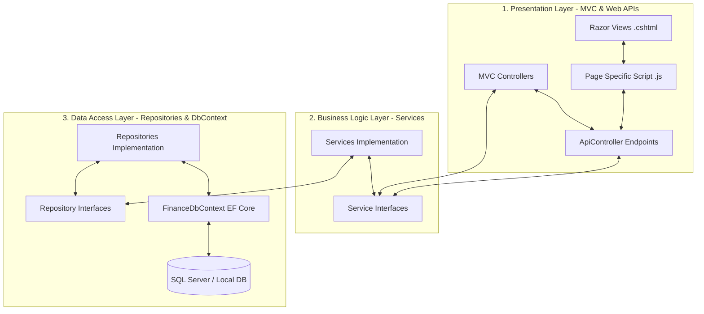
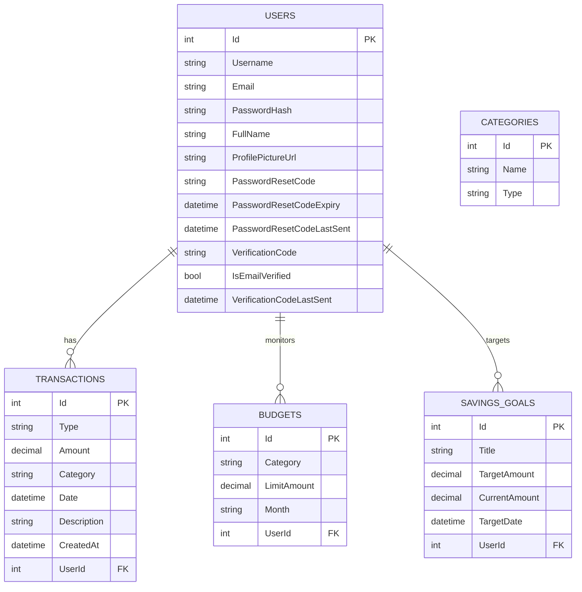
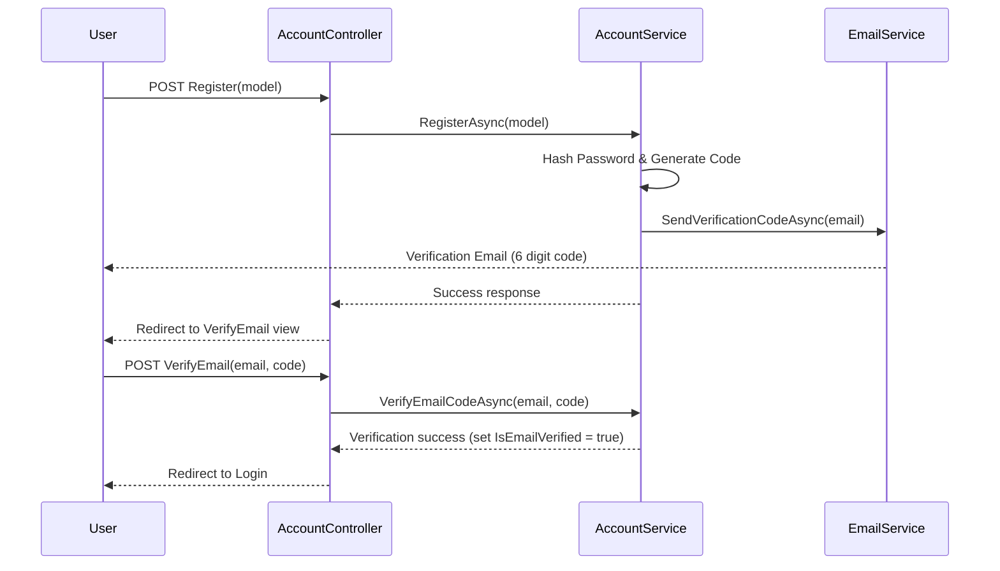

# 🛡️ Personal Finance Tracker - Deep Technical & Functional Guide

Welcome to the comprehensive, deep technical documentation for the **Personal Finance Tracker** project. This guide serves as a manual for developers and contributors to understand the codebase architecture, data schemas, API routes, workflows, and configuration details.

---

## 🏗️ Architecture & Component Design

The application enforces a rigid **3-Layer Architecture** structure. Code changes must respect and maintain the boundaries described below:



### 1. Presentation Layer (MVC & Web APIs)
- **Controller Responsibilities**: Keep controllers thin. They should perform model validation, session/authentication checks, route incoming queries, and delegate logic execution directly to injected services.
- **Client Scripts**: Client scripts must reside inside `wwwroot/js/<feature>.js` and be encapsulated using modular patterns (IIFE/classes/namespaces) to prevent namespace pollution.
- **Data Exchange**: Avoid returning raw EF Core entities to views. Use specific DTOs (Data Transfer Objects) or ViewModels to prevent circular reference serialization issues.

### 2. Business Logic Layer (Services)
- **Validation**: Implement all business validations (e.g. check if a user is trying to record a transaction on a deleted category, verify limits, double-entry logic).
- **Service Registration**: Services are registered as `Scoped` dependencies in `Program.cs`.
- **Decoupled Architecture**: Services must talk to Repositories via interfaces, never referencing `FinanceDbContext` directly.

### 3. Data Access Layer (Repositories & EF Core)
- **Database Interaction**: Encapsulated within classes implementing repository interfaces. Direct query logic (LINQ queries, SQL executes) should be restricted here.
- **Materialization**: Force LINQ execution by calling `.ToListAsync()` or `.FirstOrDefaultAsync()` before returning results to Services to avoid leaving database tracking/connections open.

---

## 💾 Detailed Database Schema & Entity Relationships

The data model uses Code-First Entity Framework Core mapping to a database (defaulting to SQL Server).



### Entities Details

#### 1. `User`
Tracks registration details, email verification status, and password-reset credentials.
- `Id` (int, PK)
- `Username` (string, required)
- `Email` (string, required)
- `PasswordHash` (string, nullable to support Google External Auth)
- `FullName` (string, nullable)
- `ProfilePictureUrl` (string, nullable)
- `VerificationCode` & `IsEmailVerified` (string/bool for signup flow validation)

#### 2. `Transaction`
Tracks all financial incomes or expenses.
- `Id` (int, PK)
- `Type` (string: `"income"` or `"expense"`)
- `Amount` (decimal, Precision 18, 2)
- `Category` (string, defaults to `"Others"`)
- `Date` (DateTime)
- `Description` (string)
- `UserId` (int, FK referencing `User`)

#### 3. `Budget`
Stores monthly spending restrictions on target categories.
- `Id` (int, PK)
- `Category` (string)
- `LimitAmount` (decimal, Precision 18, 2)
- `Month` (string, format `"YYYY-MM"`)
- `UserId` (int, FK referencing `User`)

#### 4. `SavingsGoal`
Represents specific user targets.
- `Id` (int, PK)
- `Title` (string)
- `TargetAmount` (decimal, Precision 18, 2)
- `CurrentAmount` (decimal, Precision 18, 2)
- `TargetDate` (DateTime)
- `UserId` (int, FK referencing `User`)

#### 5. `Category`
Master lookup items for UI dropdowns. Seeded with 12 items (Salary, Investment, Food & Beverage, Shopping, etc.).
- `Id` (int, PK)
- `Name` (string)
- `Type` (string: `"income"` or `"expense"`)

---

## 📋 Detailed Functional Specifications

### 1. Authentication & Session Management
- **Registration Flow**: Registers a new user. Generates a random 6-digit verification code, stores its last-sent timestamp, and transmits it via SMTP.
- **Login Flow**: Validates credential matches. Blocks user authentication if the email is not verified, redirecting them to the verification input page.
- **Simulated & Real Google Login**: If OAuth keys are missing, routes to `SimulatedGoogleLogin`. Signs in users by looking up or provisioning user profiles without standard local password requirements.
- **Logout Flow**:
  - Executed via the POST route `/Account/Logout`.
  - Terminates the session securely by invalidating cookie markers: `HttpContext.SignOutAsync(CookieAuthenticationDefaults.AuthenticationScheme)`.
  - Redirects user back to login page.

### 2. Transactions & Cascading Categories
- **Filtering & Search**: Users query transactions matching search text, type (`"income"` or `"expense"`), category name, and date bounds. Uses server-side paging (defaulting to 10 entries per page).
- **Category Creation & Protection**:
  - Custom categories check for duplicates matching name and type.
  - The default category `"Others"` is protected and cannot be deleted.
- **Cascading Category Operations**:
  - **On Category Rename**: All user transactions referencing the old category name string are updated via `UpdateCategoryNameAsync` to keep historical data intact.
  - **On Category Deletion**: All associated user transactions are dynamically updated to the default `"Others"` category via `SetCategoryToOthersAsync` before the category entity is wiped from the database.

### 3. Monthly Budgets
- **Calculation Details**: Budget evaluations calculate total category limit vs actual expenditure for the specified month.
- **Spent Evaluation**: Queries transaction records belonging to the month range (Start of month 00:00 to End of month 23:59) and aggregates expenses to return a matching list of `BudgetStatusDto` containing actual `spent` values.
- **Save Budget**: Sets category limit for a specified month. If a limit is already set, updates the amount; otherwise creates a new budget entry.

### 4. Savings Goals Funding
- **Funding Flow**: Deposits or withdraws money to/from specific goals.
- **Deposit**: Adds to the target goal's `CurrentAmount`.
- **Withdrawal**: Subtracts from the target goal's `CurrentAmount` (cannot drop below zero).

---

## 📋 Comprehensive API Route Directory

All AJAX interactions execute against the following RESTful paths. Users must be authenticated to invoke these routes.

| HTTP Method | Route Endpoint | Purpose | Expected Request / Response |
| :--- | :--- | :--- | :--- |
| **POST** | `/Account/Logout` | Sign out the active user | Clears authentication cookies and redirects to Login |
| **GET** | `/api/finance/transactions/recent` | Get top 5 transactions | Returns JSON array of `Transaction` |
| **GET** | `/api/finance/transactions` | Query filtered & paginated transactions | Params: `search`, `type`, `category`, `dateFrom`, `dateTo`, `page`, `pageSize` |
| **GET** | `/api/finance/transactions/{id}` | Fetch details of one transaction | Returns `Transaction` object or `404` |
| **POST** | `/api/finance/transactions` | Save (Create/Update) a transaction | Payload: `Transaction` object. Returns success payload |
| **DELETE** | `/api/finance/transactions/{id}` | Wipe transaction | Returns `{ success: true }` |
| **GET** | `/api/finance/budgets` | Fetch monthly budgets & actual expenditures | Params: `month` (format `"YYYY-MM"`). Returns list of `BudgetStatusDto` |
| **POST** | `/api/finance/budgets` | Set/adjust category budget limits | Payload: `Budget` object |
| **DELETE** | `/api/finance/budgets/{id}` | Remove category budget limits | Returns `{ success: true }` |
| **GET** | `/api/finance/savings` | Get user's savings goals | Returns list of `SavingsGoal` |
| **POST** | `/api/finance/savings` | Create/edit savings objectives | Payload: `SavingsGoal` object |
| **DELETE** | `/api/finance/savings/{id}` | Wipe goal object | Returns `{ success: true }` |
| **POST** | `/api/finance/savings/fund` | Deposit/withdraw from savings goal | Params: `id`, `amount`, `type` (`"deposit"` or `"withdraw"`) |
| **GET** | `/api/finance/categories` | Retrieve master category list | Returns list of `Category` |
| **POST** | `/api/finance/categories` | Custom category creation | Payload: `Category` object |
| **DELETE** | `/api/finance/categories/{id}` | Delete category | Returns `{ success: true }` |
| **GET** | `/api/finance/summary` | Get balance, expense, income, savings summary | Returns `FinancialSummaryDto` |
| **GET** | `/api/finance/backup/export` | Export personal data snapshot | Returns a downloadable backup file `finance_backup_*.json` |
| **POST** | `/api/finance/backup/import` | Upload backup file to overwrite/fill data | Request Form File. Returns success payload |
| **POST** | `/api/finance/backup/purge` | Wipe all financial data belonging to the user | Returns `{ success: true }` |

---

## 🔄 Technical Workflow & Integration Details

### 1. Registration & Email Verification Workflow


### 2. Forgot Password Flow
- The user requests a reset code via `/Account/ForgotPassword`.
- System calls `AccountService.ForgotPasswordAsync`, generates a 6-digit random code and sets expiration (2 hours).
- An email is sent via SMTP.
- The user enters code and new password at `/Account/ResetPassword`.
- System verifies code valid time, updates password hash, clears the reset code, and saves changes.

### 3. Google Login Integration
- Google Auth redirect is handled via external cookies in `Program.cs`.
- Upon success, the system checks if the email exists in our `Users` table:
  - If yes, logs them in.
  - If no, automatically registers a new user with `IsEmailVerified = true` (since Google handles verification), creates a default user entry without password hash, and logs them in.

---

## 🛠️ How to Run & Configure

### 1. Connection Strings & Local DB Setup
By default, the application runs on **SQL Server**. Set up SQL Server LocalDB or a Developer edition instance and configure the connection string in `appsettings.json`.

Run the following commands to restore tools and push the database schema:
```powershell
# Restore dotnet ef CLI tools
dotnet tool restore

# Run EF Database Update
dotnet ef database update
```

### 2. Run Command
Run the application using:
```powershell
dotnet run
```
And navigate to the printed ports.
